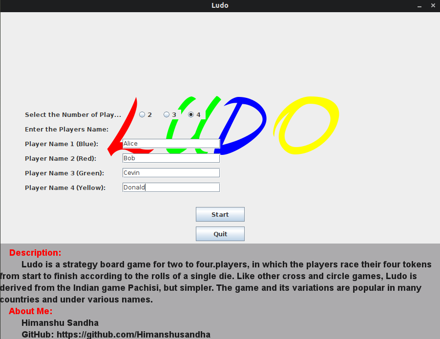
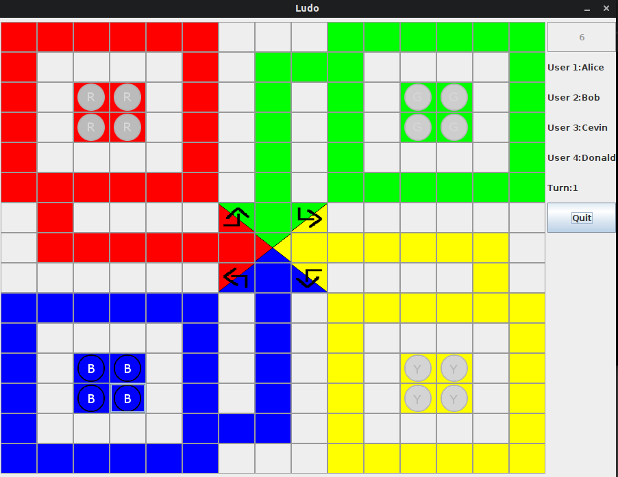
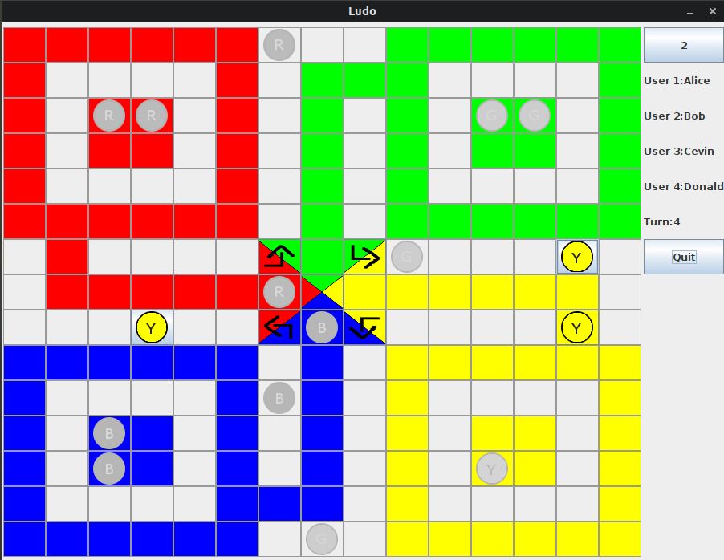
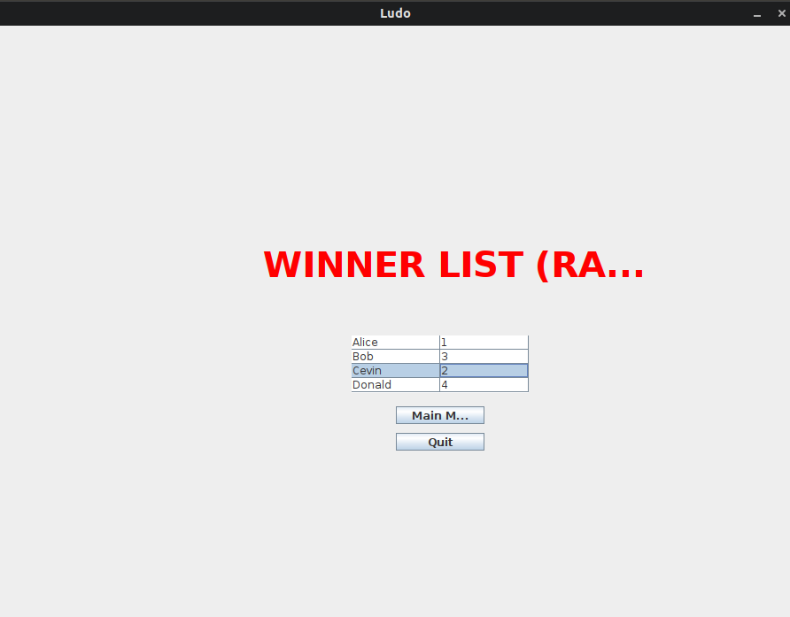

# JAVA-LUDO

<b>Ludo game implemented through java swing to play with 2,3,4 players. A try to extend java swing at a high level</b>

Ludo is a strategy board game for two to four players, in which the players race their four tokens from start to finish according to the rolls of a
single die. Like other cross and circle games, Ludo is derived from the Indian game Pachisi, but simple

Using:
1. Clone the repo in local machine or download repo as Zip on local machine & extract it

    <code>git clone https://github.com/himanshusandha/JAVA-LUDO.git</code>
  
2. Traverse to the newly added folder of repo & Open CLI for the folder.

3. Run the command:
  
   <code>javac Racing.java</code>
   
   <code>java Racing</code>
   
Yooo!!!! It's done, enjoy playing the game

<b>Username set screen</b> 

<b>Gameplay screen</b> 

<b>Gameplay screen</b> 

<b>Winner list</b> 

